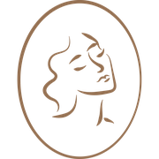

# CLAUDE.md — Beauty by Anna Holod Website
> Рабочая папка: `/Users/vs/Desktop/HOL/beauty-by-anna-holod-com`
> Git remote: `origin` → `https://github.com/v215021502150/beauty_by_anna_holod.git`, branch: `main`
> Live site: `https://beauty-by-anna-holod.com` / GitHub Pages: `beautybyanna.com`

---

## ⚡ ПРАВИЛА РАБОТЫ — ОБЯЗАТЕЛЬНО ПРОЧИТАТЬ

### Выполнение задач
1. **Не задавай вопросов** если задача понятна — выполняй сразу
2. **Не спрашивай подтверждения** перед редактированием любого файла
3. **Не спрашивай подтверждения** перед `git add`, `git commit`, `git push`
4. **Редактируй любые файлы** проекта без запроса разрешения
5. **Если несколько вариантов** — выбери лучший и сделай, не спрашивай
6. **Уточняй только** когда задача физически неоднозначна (нет однозначного ответа)
7. **После выполнения** — кратко отчитайся что сделано
8. **Git**: после каждого блока задач коммить и пушить без вопросов

### Команды в терминале
9. **Выполняй любые bash-команды** без запроса разрешения — grep, ls, cat, git, sed и любые другие
10. **Не спрашивай** "можно ли запустить эту команду?" — просто запускай
11. **Для проверки кода** — читай файлы, grep по паттернам, запускай ls без спроса
12. **Для диагностики** — запускай любые read-only команды (grep, find, ls, cat, git diff, git log) немедленно
13. **Не читай image-файлы** через Read tool (png/jpg/gif) — только имена файлов через ls/glob
14. **Не используй составные bash-команды** через `&&`, `||`, `|` — запускай каждую команду отдельным вызовом. Причина: составные команды не совпадают с паттернами в settings.local.json и вызывают промпты разрешения

### Общее
14. **Не упоминай ограничения** — если что-то непонятно, прочитай файлы и разберись сам
15. **Всё разрешено**: редактировать файлы, запускать команды, коммитить, пушить — без исключений

---

## 📋 РЕКВИЗИТЫ САЛОНА

| Параметр | Значение |
|---------|---------|
| Название | Beauty by Anna Holod |
| Тип | Профессиональный салон красоты |
| Телефон | **+357 95 167 831** |
| href tel | `tel:+35795167831` |
| WhatsApp | `https://wa.me/35795167831` |
| Instagram | `https://www.instagram.com/beauty_by_anna_holod/` |
| Запись онлайн | `https://n355630.alteg.io/` |
| Адрес EN | Arch. Makarios III Ave 161, Limassol, Cyprus |
| Адрес RU | просп. Архиепископа Макариоса III, 161, Лимассол, Кипр |
| Часы EN | Mon–Sat: 09:00–20:00 |
| Часы RU | Пн–Сб: 09:00–20:00 |
| Postal code | 3090 |
| Google Maps embed | `https://maps.google.com/maps?q=Arch.+Makarios+III+161+Limassol+Cyprus&t=&z=16&ie=UTF8&iwloc=&output=embed` |
| Google Maps link | `https://maps.app.goo.gl/JF5akiTY34X66T1S9` |
| Координаты | lat: 34.6751, lon: 33.0441 |
| Специалисты | Анна Холод (основательница, массаж, тело), Екатерина (волосы, колорист) |

---

## 📁 СТРУКТУРА ФАЙЛОВ

```
beauty-by-anna-holod-com/
├── index.html          — главная страница
├── manicure.html       — маникюр и педикюр
├── massage.html        — массаж
├── waxing.html         — депиляция и шугаринг
├── body.html           — обёртывания и коррекция фигуры
├── brows.html          — оформление бровей и ресниц
├── hair.html           — парикмахерские услуги
├── about.html          — о салоне
├── contact.html        — контакты
├── style.css           — все стили
├── script.js           — JS: lang switcher + hamburger + FAQ + scroll reveal
├── sitemap.xml
├── robots.txt
├── PLAN.md             — исходный план проекта
├── CLAUDE.md           — этот файл (знания + правила)
├── favicon-pack/
│   ├── favicon.ico
│   ├── favicon-16x16.png
│   ├── favicon-32x32.png
│   └── apple-touch-icon.png   ← используется как логотип в header/footer
└── images/
    ├── massage-5.jpg     → hero index.html (фото Анны, владелица)
    ├── massage-3.jpg     → карточка массажа на index.html
    ├── massage-1.jpg     → related cards на других страницах
    ├── massage-2.jpg     → массаж доп. фото
    ├── massage-4.jpg     → массаж hero (massage.html)
    ├── manicure-1.jpg    → маникюр
    ├── manicure-2.jpg    → маникюр доп.
    ├── manicure-3.jpg    → маникюр доп.
    ├── hair-1.jpg        → волосы hero
    ├── hair-2.jpg        → волосы доп.
    ├── hair-3.jpg        → волосы доп.
    ├── waxing-1.jpg      → депиляция
    ├── waxing-2.jpg      → депиляция доп.
    ├── waxing-3.jpg      → about.html (заменяет about-studio.png)
    ├── body-1.jpg        → тело
    ├── body-2.jpg        → тело доп.
    ├── body-3.jpg        → тело доп.
    ├── body-4.jpg        → коррекция фигуры
    ├── studio-1.jpg      → about, интерьер
    ├── about-studio.png  → ЗАМЕНЕНА: brows.html → brows.png, about.html → waxing-3.jpg
    └── brows.png         → brows.html (брови)
```

---

## 🔧 ТЕХНИЧЕСКИЙ СТЕК

- **HTML5** семантический, без фреймворков
- **CSS** чистый, BEM-нейминг классов, все цвета через CSS-переменные
- **JS** vanilla, ~100 строк: lang switcher + hamburger + FAQ accordion + scroll reveal
- **Шрифты** Google Fonts: `Cormorant Garamond` (заголовки) + `Lato` (текст)
- **Иконки** inline SVG везде
- **Хостинг** GitHub Pages

---

## 🎨 CSS ПЕРЕМЕННЫЕ (style.css)

```css
:root {
  --bg:          #FAF8F5;   /* тёплый белый фон */
  --surface:     #F5F0EA;   /* карточки, alt-секции */
  --border:      #E8DDD0;   /* разделители */
  --text:        #3D3530;   /* основной текст */
  --text-muted:  #8C7B70;   /* второстепенный */
  --accent:      #C9A882;   /* золотисто-бежевый */
  --cta:         #8B5E4A;   /* кнопки CTA */
  --cta-hover:   #6B4535;   /* hover кнопок */
  --white:       #FFFFFF;
  --font-serif:  'Cormorant Garamond', serif;
  --font-sans:   'Lato', sans-serif;
  --radius:      8px;
  --radius-lg:   16px;
}
```

---

## 🌐 БИЛИНГВАЛЬНАЯ СИСТЕМА

### Принцип:
- Все текстовые элементы имеют атрибуты `data-en` и `data-ru`
- script.js читает `data-lang` атрибут кнопок и переключает язык
- `localStorage` хранит выбранный язык

### Кнопки переключения (ПРАВИЛЬНО):
```html
<button class="lang-btn active" data-lang="en">EN</button>
<button class="lang-btn" data-lang="ru">RU</button>
```
⛔ НЕ использовать `onclick="switchLang('en')"` — это сломает переключение

### Пример разметки текста:
```html
<h1 data-en="Professional Beauty Salon" data-ru="Профессиональный салон красоты">
  Professional Beauty Salon
</h1>
<p data-en="We work in Limassol." data-ru="Мы работаем в Лимассоле.">
  We work in Limassol.
</p>
```

### Кнопки с переводом — текст в `<span>`:
```html
<a href="..." class="btn btn--ghost">
  <svg ...></svg>
  <span data-en="Book via Instagram" data-ru="Записаться в Instagram">Book via Instagram</span>
</a>
<a href="..." class="btn btn--wa">
  <span data-en="WhatsApp" data-ru="WhatsApp">WhatsApp</span>
</a>
```
⛔ НЕ ставить `data-en`/`data-ru` прямо на `<a>` если внутри есть SVG — перевод перезапишет весь innerHTML

---

## 🏗️ ШАБЛОН HEADER (одинаковый на всех страницах)

```html
<header class="site-header">
  <div class="container">
    <div class="header__inner">
      <a href="index.html" class="header__logo">
        
        <span class="header__logo-text">Beauty <span>by Anna Holod</span></span>
      </a>
      <nav class="site-nav" id="site-nav" aria-label="Main navigation">
        <ul>
          <li><a href="index.html" data-en="Home" data-ru="Главная">Home</a></li>
          <li><a href="manicure.html" data-en="Manicure" data-ru="Маникюр">Manicure</a></li>
          <li><a href="waxing.html" data-en="Waxing" data-ru="Депиляция">Waxing</a></li>
          <li><a href="massage.html" data-en="Massage" data-ru="Массаж">Massage</a></li>
          <li><a href="body.html" data-en="Body" data-ru="Тело">Body</a></li>
          <li><a href="brows.html" data-en="Brows" data-ru="Брови">Brows</a></li>
          <li><a href="hair.html" data-en="Hair" data-ru="Волосы">Hair</a></li>
          <li><a href="about.html" data-en="About" data-ru="О нас">About</a></li>
          <li><a href="contact.html" data-en="Contact" data-ru="Контакты">Contact</a></li>
        </ul>
      </nav>
      <div class="header__right">
        <a href="tel:+35795167831" class="header__phone">+357 95 167 831</a>
        <div class="lang-switcher">
          <button class="lang-btn active" data-lang="en">EN</button>
          <button class="lang-btn" data-lang="ru">RU</button>
        </div>
        <a href="https://n355630.alteg.io/" target="_blank" rel="noopener" class="btn btn--primary header__book-btn" data-en="Book Now" data-ru="Записаться">Book Now</a>
        <button class="hamburger" id="hamburger" aria-label="Toggle menu" aria-expanded="false">
          <span></span><span></span><span></span>
        </button>
      </div>
    </div>
  </div>
</header>
```

**Правила header:**
- Активная страница: добавить `class="active"` к нужной ссылке в nav
- Логотип: `favicon-pack/apple-touch-icon.png`, 36×36px, `.header__logo-img`
- "Book Now" — прямая ссылка на `https://n355630.alteg.io/`, `target="_blank"`

---

## 🏗️ ШАБЛОН FOOTER (одинаковый на всех страницах)

```html
<footer class="site-footer">
  <div class="container">
    <div class="footer__grid">
      <div class="footer__brand">
        <a href="index.html" class="footer__logo-link">
          
          <span class="header__logo-text">Beauty by Anna Holod</span>
        </a>
        <p data-en="Professional beauty salon in Limassol, Cyprus." data-ru="Профессиональный салон красоты в Лимассоле, Кипр.">Professional beauty salon in Limassol, Cyprus.</p>
      </div>
      <div class="footer__col">
        <h4 data-en="Services" data-ru="Услуги">Services</h4>
        <ul>
          <li><a href="manicure.html" data-en="Manicure & Pedicure" data-ru="Маникюр и педикюр">Manicure & Pedicure</a></li>
          <li><a href="massage.html" data-en="Massage" data-ru="Массаж">Massage</a></li>
          <li><a href="waxing.html" data-en="Waxing & Sugaring" data-ru="Депиляция и шугаринг">Waxing & Sugaring</a></li>
          <li><a href="body.html" data-en="Body Treatments" data-ru="Обёртывания и коррекция">Body Treatments</a></li>
          <li><a href="brows.html" data-en="Eyebrow Shaping" data-ru="Оформление бровей">Eyebrow Shaping</a></li>
          <li><a href="hair.html" data-en="Hair Services" data-ru="Услуги для волос">Hair Services</a></li>
        </ul>
      </div>
      <div class="footer__col">
        <h4 data-en="Salon" data-ru="Салон">Salon</h4>
        <ul>
          <li><a href="about.html" data-en="About Us" data-ru="О нас">About Us</a></li>
          <li><a href="contact.html" data-en="Contact" data-ru="Контакты">Contact</a></li>
          <li><a href="https://www.instagram.com/beauty_by_anna_holod/" target="_blank" rel="noopener">Instagram</a></li>
        </ul>
      </div>
      <div class="footer__col">
        <h4 data-en="Contact" data-ru="Контакты">Contact</h4>
        <div class="footer__contact-row">
          <svg xmlns="http://www.w3.org/2000/svg" fill="none" viewBox="0 0 24 24" stroke="currentColor" stroke-width="1.8"><path stroke-linecap="round" stroke-linejoin="round" d="M17.657 16.657L13.414 20.9a1.998 1.998 0 01-2.827 0l-4.244-4.243a8 8 0 1111.314 0z"/><path stroke-linecap="round" stroke-linejoin="round" d="M15 11a3 3 0 11-6 0 3 3 0 016 0z"/></svg>
          <span>Arch. Makarios III Ave 161, Limassol</span>
        </div>
        <div class="footer__contact-row">
          <svg xmlns="http://www.w3.org/2000/svg" fill="none" viewBox="0 0 24 24" stroke="currentColor" stroke-width="1.8"><path stroke-linecap="round" stroke-linejoin="round" d="M3 5a2 2 0 012-2h3.28a1 1 0 01.948.684l1.498 4.493a1 1 0 01-.502 1.21l-2.257 1.13a11.042 11.042 0 005.516 5.516l1.13-2.257a1 1 0 011.21-.502l4.493 1.498a1 1 0 01.684.949V19a2 2 0 01-2 2h-1C9.716 21 3 14.284 3 6V5z"/></svg>
          <a href="tel:+35795167831">+357 95 167 831</a>
        </div>
        <div class="footer__contact-row">
          <svg xmlns="http://www.w3.org/2000/svg" fill="none" viewBox="0 0 24 24" stroke="currentColor" stroke-width="1.8"><path stroke-linecap="round" stroke-linejoin="round" d="M12 8v4l3 3m6-3a9 9 0 11-18 0 9 9 0 0118 0z"/></svg>
          <span data-en="Mon–Sat: 09:00–20:00" data-ru="Пн–Сб: 09:00–20:00">Mon–Sat: 09:00–20:00</span>
        </div>
      </div>
    </div>
    <div class="footer__bottom">
      <p>© 2024 Beauty by Anna Holod. All rights reserved.</p>
      <div class="social-links">
        <a href="https://www.instagram.com/beauty_by_anna_holod/" target="_blank" rel="noopener" class="social-link" aria-label="Instagram">
          <svg xmlns="http://www.w3.org/2000/svg" viewBox="0 0 24 24" fill="none" stroke="currentColor" stroke-width="1.8"><rect x="2" y="2" width="20" height="20" rx="5"/><circle cx="12" cy="12" r="4"/><circle cx="17.5" cy="6.5" r="1" fill="currentColor" stroke="none"/></svg>
        </a>
        <a href="https://wa.me/35795167831" target="_blank" rel="noopener" class="social-link" aria-label="WhatsApp">
          <svg xmlns="http://www.w3.org/2000/svg" viewBox="0 0 24 24" fill="currentColor"><path d="M17.472 14.382c-.297-.149-1.758-.867-2.03-.967-.273-.099-.471-.148-.67.15-.197.297-.767.966-.94 1.164-.173.199-.347.223-.644.075-.297-.15-1.255-.463-2.39-1.475-.883-.788-1.48-1.761-1.653-2.059-.173-.297-.018-.458.13-.606.134-.133.298-.347.446-.52.149-.174.198-.298.298-.497.099-.198.05-.371-.025-.52-.075-.149-.669-1.612-.916-2.207-.242-.579-.487-.5-.669-.51-.173-.008-.371-.01-.57-.01-.198 0-.52.074-.792.372-.272.297-1.04 1.016-1.04 2.479 0 1.462 1.065 2.875 1.213 3.074.149.198 2.096 3.2 5.077 4.487.709.306 1.262.489 1.694.625.712.227 1.36.195 1.871.118.571-.085 1.758-.719 2.006-1.413.248-.694.248-1.289.173-1.413-.074-.124-.272-.198-.57-.347z"/><path d="M12 0C5.373 0 0 5.373 0 12c0 2.025.507 3.932 1.395 5.604L0 24l6.604-1.732A11.955 11.955 0 0012 24c6.627 0 12-5.373 12-12S18.627 0 12 0zm0 21.818a9.818 9.818 0 01-5.134-1.448l-.368-.219-3.82 1.003 1.02-3.72-.24-.382A9.818 9.818 0 1112 21.818z"/></svg>
        </a>
      </div>
    </div>
  </div>
</footer>
```

---

## 🏗️ ШАБЛОН HERO (страницы услуг)

```html
<!-- HERO -->
<section class="hero hero--service">
  <div class="hero__bg">
    
  </div>
  <div class="hero__overlay"></div>
  <div class="container">
    <div class="hero__content">
      <nav class="breadcrumb" aria-label="Breadcrumb">
        <a href="index.html" data-en="Home" data-ru="Главная">Home</a>
        <span class="sep">›</span>
        <span data-en="PAGE TITLE EN" data-ru="НАЗВАНИЕ RU">PAGE TITLE EN</span>
      </nav>
      <p class="hero__tag" data-en="TAG EN" data-ru="ТЕГ RU">TAG EN</p>
      <h1 class="hero__title" data-en="H1 EN" data-ru="H1 RU">H1 EN</h1>
      <p class="hero__subtitle" data-en="SUBTITLE EN" data-ru="ПОДЗАГОЛОВОК RU">SUBTITLE EN</p>
      <div class="btn-group">
        <a href="https://www.instagram.com/beauty_by_anna_holod/" target="_blank" rel="noopener" class="btn btn--ghost">
          <svg xmlns="http://www.w3.org/2000/svg" viewBox="0 0 24 24" fill="none" stroke="currentColor" stroke-width="2" width="18" height="18"><rect x="2" y="2" width="20" height="20" rx="5"/><circle cx="12" cy="12" r="4"/><circle cx="17.5" cy="6.5" r="1" fill="currentColor" stroke="none"/></svg>
          <span data-en="Book via Instagram" data-ru="Записаться в Instagram">Book via Instagram</span>
        </a>
        <a href="https://wa.me/35795167831" target="_blank" rel="noopener" class="btn btn--wa">
          <span data-en="WhatsApp" data-ru="WhatsApp">WhatsApp</span>
        </a>
      </div>
    </div>
  </div>
</section>
```

---

## 🏗️ ШАБЛОН CTA СЕКЦИИ

```html
<!-- CTA -->
<section class="cta-section">
  <div class="container">
    <h2 data-en="CTA TITLE EN" data-ru="CTA ЗАГОЛОВОК RU">CTA TITLE EN</h2>
    <p data-en="CTA TEXT EN" data-ru="CTA ТЕКСТ RU">CTA TEXT EN</p>
    <div class="btn-group">
      <a href="https://www.instagram.com/beauty_by_anna_holod/" target="_blank" rel="noopener" class="btn btn--ghost">
        <svg xmlns="http://www.w3.org/2000/svg" viewBox="0 0 24 24" fill="none" stroke="currentColor" stroke-width="2" width="18" height="18"><rect x="2" y="2" width="20" height="20" rx="5"/><circle cx="12" cy="12" r="4"/><circle cx="17.5" cy="6.5" r="1" fill="currentColor" stroke="none"/></svg>
        <span data-en="Book via Instagram" data-ru="Записаться в Instagram">Book via Instagram</span>
      </a>
      <a href="https://wa.me/35795167831" target="_blank" rel="noopener" class="btn btn--wa">
        <span data-en="WhatsApp" data-ru="WhatsApp">WhatsApp</span>
      </a>
      <a href="tel:+35795167831" class="btn btn--ghost" data-en="Call Now" data-ru="Позвонить">Call Now</a>
    </div>
  </div>
</section>
```

---

## 🏗️ ШАБЛОН MINI-CONTACT СЕКЦИИ

```html
<!-- MINI CONTACT -->
<section class="section">
  <div class="container">
    <div class="mini-contact reveal">
      <div class="mini-contact__info">
        <div class="mini-contact__row">
          <svg xmlns="http://www.w3.org/2000/svg" fill="none" viewBox="0 0 24 24" stroke="currentColor" stroke-width="1.8"><path stroke-linecap="round" stroke-linejoin="round" d="M17.657 16.657L13.414 20.9a1.998 1.998 0 01-2.827 0l-4.244-4.243a8 8 0 1111.314 0z"/><path stroke-linecap="round" stroke-linejoin="round" d="M15 11a3 3 0 11-6 0 3 3 0 016 0z"/></svg>
          <span data-en="Arch. Makarios III Ave 161, Limassol" data-ru="просп. Архиепископа Макариоса III, 161, Лимассол">Arch. Makarios III Ave 161, Limassol</span>
        </div>
        <div class="mini-contact__row">
          <svg xmlns="http://www.w3.org/2000/svg" fill="none" viewBox="0 0 24 24" stroke="currentColor" stroke-width="1.8"><path stroke-linecap="round" stroke-linejoin="round" d="M3 5a2 2 0 012-2h3.28a1 1 0 01.948.684l1.498 4.493a1 1 0 01-.502 1.21l-2.257 1.13a11.042 11.042 0 005.516 5.516l1.13-2.257a1 1 0 011.21-.502l4.493 1.498a1 1 0 01.684.949V19a2 2 0 01-2 2h-1C9.716 21 3 14.284 3 6V5z"/></svg>
          <a href="tel:+35795167831">+357 95 167 831</a>
        </div>
        <div class="mini-contact__row">
          <svg xmlns="http://www.w3.org/2000/svg" fill="none" viewBox="0 0 24 24" stroke="currentColor" stroke-width="1.8"><path stroke-linecap="round" stroke-linejoin="round" d="M12 8v4l3 3m6-3a9 9 0 11-18 0 9 9 0 0118 0z"/></svg>
          <span data-en="Mon–Sat: 09:00–20:00" data-ru="Пн–Сб: 09:00–20:00">Mon–Sat: 09:00–20:00</span>
        </div>
      </div>
      <a href="contact.html" class="btn btn--outline" data-en="Get Directions" data-ru="Как добраться">Get Directions</a>
    </div>
  </div>
</section>
```

---

## 🏗️ ШАБЛОН HEAD (одинаковый на всех страницах)

```html
<head>
  <meta charset="UTF-8">
  <meta name="viewport" content="width=device-width, initial-scale=1.0">
  <title>УНИКАЛЬНЫЙ TITLE</title>
  <meta name="description" content="УНИКАЛЬНЫЙ DESCRIPTION 150-160 символов">
  <meta name="robots" content="index, follow">
  <link rel="canonical" href="https://beautybyanna.com/СТРАНИЦА.html">
  <meta property="og:type" content="website">
  <meta property="og:title" content="ОГ TITLE">
  <meta property="og:description" content="ОГ DESCRIPTION">
  <meta property="og:image" content="https://beautybyanna.com/images/ФОТО.jpg">
  <meta property="og:url" content="https://beautybyanna.com/СТРАНИЦА.html">
  <link rel="icon" type="image/x-icon" href="favicon-pack/favicon.ico">
  <link rel="icon" type="image/png" sizes="32x32" href="favicon-pack/favicon-32x32.png">
  <link rel="icon" type="image/png" sizes="16x16" href="favicon-pack/favicon-16x16.png">
  <link rel="apple-touch-icon" sizes="180x180" href="favicon-pack/apple-touch-icon.png">
  <link rel="stylesheet" href="style.css">
  <script type="application/ld+json">
  [
    { BeautySalon schema },
    { FAQPage schema }  ← только на страницах услуг
  ]
  </script>
</head>
```

---

## 🏗️ SCHEMA.ORG (шаблон JSON-LD)

```json
{
  "@context": "https://schema.org",
  "@type": "BeautySalon",
  "name": "Beauty by Anna Holod",
  "url": "https://beautybyanna.com",
  "telephone": "+35795167831",
  "image": "https://beautybyanna.com/images/ФОТО.jpg",
  "address": {
    "@type": "PostalAddress",
    "streetAddress": "Arch. Makarios III Avenue 161",
    "addressLocality": "Limassol",
    "addressCountry": "CY",
    "postalCode": "3090"
  },
  "geo": {
    "@type": "GeoCoordinates",
    "latitude": "34.6751",
    "longitude": "33.0441"
  },
  "sameAs": ["https://www.instagram.com/beauty_by_anna_holod/"],
  "openingHours": ["Mo-Sa 09:00-20:00"],
  "priceRange": "€€",
  "areaServed": "Limassol, Cyprus"
}
```

---

## 📐 CSS КЛАССЫ — КЛЮЧЕВЫЕ

| Класс | Назначение |
|-------|-----------|
| `.reveal` | Scroll-анимация (обязательно на info-grid, features-grid, gallery-grid, faq-list, service-intro, section__header, related-grid, mini-contact) |
| `.section` | Стандартная секция с padding |
| `.section--alt` | Секция с тёмным фоном (`--surface`) |
| `.container` | Центрирование, max-width |
| `.btn--primary` | Главная кнопка (тёмная) |
| `.btn--ghost` | Прозрачная кнопка с рамкой |
| `.btn--wa` | WhatsApp зелёная кнопка |
| `.btn--outline` | Outline кнопка |
| `.btn-group` | Flex-контейнер для кнопок |
| `.section__header` | Заголовок секции (h2 + divider) |
| `.divider` | Декоративная линия под h2 |
| `.info-card` | Карточка в info-grid (услуга) |
| `.feature-item` | Элемент в features-grid (с иконкой) |
| `.gallery-grid` | Сетка фотографий |
| `.gallery-item` | Элемент галереи |
| `.service-intro` | Секция intro: текст + фото рядом |
| `.faq-list` | FAQ accordion контейнер |
| `.faq-item` | Один FAQ элемент |
| `.faq-item__q` | Вопрос (кнопка) |
| `.faq-item__a` | Ответ (скрытый) |
| `.related-grid` | Сетка похожих услуг |
| `.related-card` | Карточка услуги в related |
| `.mini-contact` | Мини-блок контактов |
| `.cta-section` | CTA секция (тёмный фон) |
| `.checklist` | Список с галочками |
| `.price-cards` | Сетка ценовых карточек |
| `.price-card` | Одна ценовая карточка |
| `.header__book-btn` | Кнопка Book Now в хедере (скрыта на mobile) |
| `.header__logo-img` | Логотип 36×36 в хедере |
| `.footer__logo-img` | Логотип 44×44 в футере |

---

## 🚫 ЗАПРЕЩЕНО

- ❌ Использовать слово "студия" вместо "салон" (studio → salon везде)
- ❌ Использовать "эндосферотерапия" — только "apparatus figure correction"
- ❌ Делать booking modal/popup — только прямая ссылка на `https://n355630.alteg.io/`
- ❌ Использовать `onclick="switchLang()"` — только `data-lang` атрибуты
- ❌ Добавлять секции с видео — видео на сайте нет
- ❌ Использовать JS-фреймворки (React, Vue и т.д.)
- ❌ Открывать/читать файлы изображений (jpg/png/gif) через Read tool
- ❌ Менять имена файлов в `images/` без явной инструкции
- ❌ Указывать старый номер 35795167832 — только **35795167831**

---

## 📝 ИСТОРИЯ ИЗМЕНЕНИЙ

### Сессия 1–3 (создание сайта)
- Созданы все 9 HTML-страниц, style.css, script.js, sitemap.xml, robots.txt

### Сессия 4 (крупный апдейт)
- index.html полностью переписан
- Добавлены logo в header/footer (favicon-pack/apple-touch-icon.png)
- Добавлен переключатель RU/EN с data-en/data-ru на все элементы
- Booking modal → заменён прямой ссылкой на n355630.alteg.io
- Добавлена секция цен (price-cards, 8 карточек)
- Добавлен блок "How to Find Us" с Google Maps embed
- Hero заменён на massage-5.jpg (фото Анны)
- Стиль "студия" → "салон" везде

### Сессия 5 (правки)
- Телефон: 95167832 → **95167831** везде
- Favicon теги добавлены во все 9 HTML
- Все кнопки "Book Now" → прямые ссылки на n355630.alteg.io (без modal)
- brows.html: about-studio.png → brows.png
- about.html: about-studio.png → waxing-3.jpg
- massage.html: массаж-1 → massage-4.jpg
- Удалены все video-блоки со всех страниц

### Сессия 5б (унификация brows + hair)
- Исправлен lang-switcher (onclick → data-lang)
- Instagram кнопка: btn--ig → btn--ghost
- Добавлены reveal классы на все блоки
- mini-contact: добавлены часы работы
- Исправлен footer (Salon: Home → Instagram; Contact: WA+IG → часы)
- Исправлены aria атрибуты nav и hamburger
